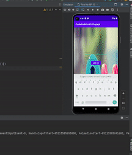

<!-- (This is a comment) INSTRUCTIONS: Go through this page and fill out any **bolded** entries with their correct values.-->

# AND101 Milestone 2 - **Team/App Name**

Submitted by:
- **Roy Chen**
- **Sandy**
- **Joseph Arias**
- **etc**

Time spent: **X** hours spent in total

## Summary

This document provides a summary of our project building process for our app, **DigitalFitness**

## Milestone Requirements

<!-- Please be sure to change the [ ] to [x] for any features you completed.  If a feature is not checked [x], you might miss the points for that item! -->

The following REQUIRED features are completed:

- [x ] Assign features to each member of your group
- [ x] Establish a goal time for completing each feature

The following REQUIRED files are included:

- [ ] Updated 📄 `project_spec.md`, which contains:
  - [X] App Overview (Milestone 1)
  - [X] App Spec (Milestone 1)
  - [x] Checked off 2+ completed features
  - [x ] 2+ GIFs of build progress

- [ x] Our 🎥 Demo Video
  - [ x] We have also added the Demo Video Link to the Group Info Form on the course portal.

The following EXTRA features are implemented:

- [ ] List anything else that you added to improve your submission!

## 🎥 Demo Video

Here's a video that demos all of the app's implemented features:

VIDEO created with **your chosen video tool**
https://docs.google.com/presentation/d/1v3rwBTQfmHpRKyUq1VfZYPqNUKqQYVSK08bfnNMUzSk/edit?usp=sharing

## Notes

Here's a place for any other notes on this milestone!
